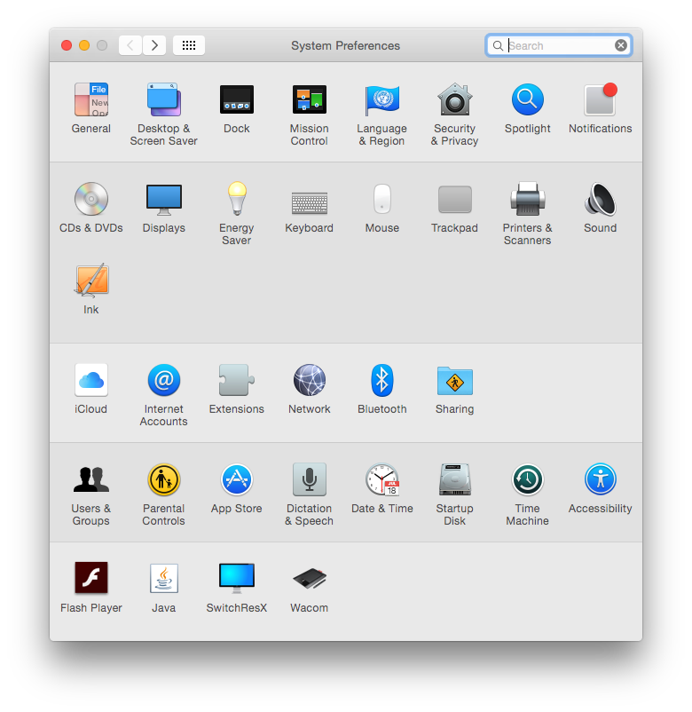
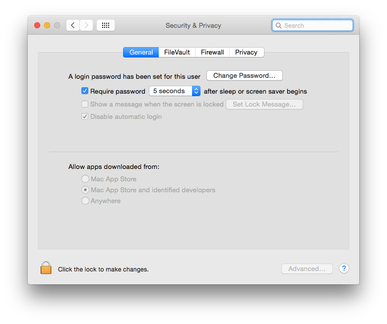

# Playrr

Open source audio playrr!  
No illegal technical tricks, so completely legal!  
No audio adds :D  


* [Installing on OSX](#install-osx)
* [Installing on Windows](#install-windows)
* [Installing on Linux](#install-linux)

<!--

-->


It's very **beta**, which means that its fare from a bug-free product.  
Use it with this in mind (and help or create an issue). 


## Uses:

- [Haxe](http://www.haxe.org) (Haxe is awesome! One codebase, many targets, no platform specific code.)
- Spotify artist search and most popular tracks
- Youtube for the music (videos)


## Limitations

- Artist you are looking for must be on Spotify.
- Top track from that artist needs to be on Youtube.


<a name="install-osx"></a>
## Install OSX

To make the install of Playrr smoother, I need a license from Apple.  
Don't have that (yet), so we need to make sure your highly tuned OSX allows us to install the app. Follow the instructions below (till the last point) 

1. Download [`Playrr.app.zip`](https://github.com/MatthijsKamstra/playrr/raw/master/download/Playrr.app.zip) and unzip
2. Open "System preferences" ([1](#install1))
	- Click on "Security & Privacy" 
3. Choose tab "General" ([2](#install2))
	- Click on lock at the bottom left: "Click the lock to make changes"
	- Change "Allow apps downloaded from" to "Anywhere"
	- Keep this window open
4. Now open `Playrr.app` you just unzipped
5. Kablammmm you are a brand new `Playrr` user, thank you!
6. **Important:** Go back to the "Security & Privacy" 
	- **Change "Allow apps downloaded from" back to "Mac App Store and identified developers" or stricter.**


<a name="install1"></a>
*screenshot 1*


<a name="install2"></a>
*screenshot 2*



<a name="install-windows"></a>
## Install Windows

I would love to help, but I have no way of testing this.
So do you want to help me test it?


<a name="install-linux"></a>
## Install Linux

I would love to help, but I have no way of testing this.
So do you want to help me test it?


## Build

So you ended up here... Must be a developer.  
This project is a Haxe project, uses NPM, Node.js, Javascript, JQuery

(I need to write more about the Haxe process, but for now I presume you are a Haxe dev)  
There are two Haxe build `.hxml`  

- debug.hxml
- release.hxml


**Start npm-watch and open browser (debug)**

```
# cd to the correct folder (change:'/path/to/playrr/folder')
cd /path/to/playrr/folder
# update `node_modules`
npm install
# force to open a browser window
open http://localhost:3000
# start watching using NPM
npm run watch
# yeah!

```

**Package your Electron app into OS-specific bundles (debug)**

```
# cd to the correct folder (change:'/path/to/playrr/folder')
cd /path/to/playrr/folder
# build a debug version 
haxe debug.hxml
# open bin folder
cd /path/to/playrr/folder/bin/
# update `node_modules`
npm install
# package your Electron app into OS-specific bundles 
electron-packager . Playrr[d]  --out /path/to/playrr/folder/out --all=true --version=0.36.4 --app-version=0.0.1 --overwrite --icon /path/to/playrr/folder/assets/playrr
# go!
```


## With a little help

[Haxe](http://www.haxe.org) obviously!

##### Haxelibs

- https://github.com/clemos/haxe-js-kit
- https://github.com/fponticelli/hxelectron

##### Electron

- http://electron.atom.io/
- https://github.com/maxogden/electron-packager