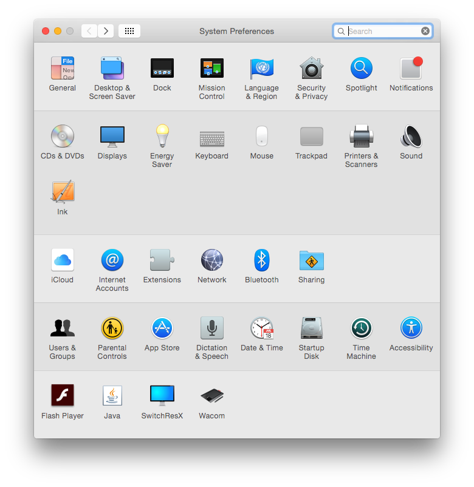
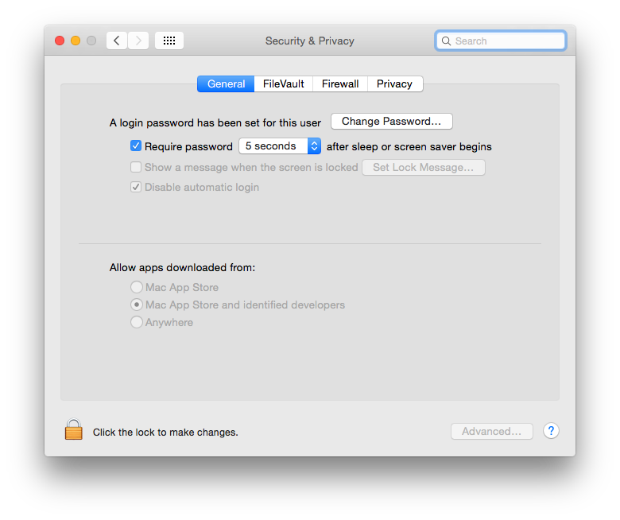

# Install Playrr

I try to make this as easy as I can, but have limited resources so I haven't tested it on Windows or Linux.

* [Installing on OSX](#install-osx)
* [Installing on Windows](#install-windows)
* [Installing on Linux](#install-linux)

## Install OSX

To make the install of Playrr smoother, I need a license from Apple.  
Don't have that (yet), so we need to make sure your highly tuned OSX allows us to install the app. Follow the instructions below (till the last point) 

1. Download [`Playrr.app.zip`](https://github.com/MatthijsKamstra/playrr/raw/master/download/Playrr.app.zip) and unzip
2. Open "System preferences" ([1](#install1))
	- Click on "Security & Privacy" 
3. Choose tab "General" ([2](#install2))
	- Click on lock at the bottom left: "Click the lock to make changes"
	- Change "Allow apps downloaded from" to "Anywhere"
	- Keep this window open
4. Now open `Playrr.app` you just unzipped
5. Kablammmm you are a brand new `Playrr` user, thank you!
6. **Important:** Go back to the "Security & Privacy" 
	- **Change "Allow apps downloaded from" back to "Mac App Store and identified developers" or stricter.**

*screenshot 1*  

*screenshot 2*  

## Install Windows

I would love to help, but I have no way of testing this.
So do you want to help me test it?

## Install Linux

I would love to help, but I have no way of testing this.
So do you want to help me test it?

